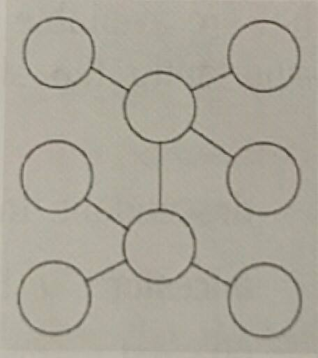
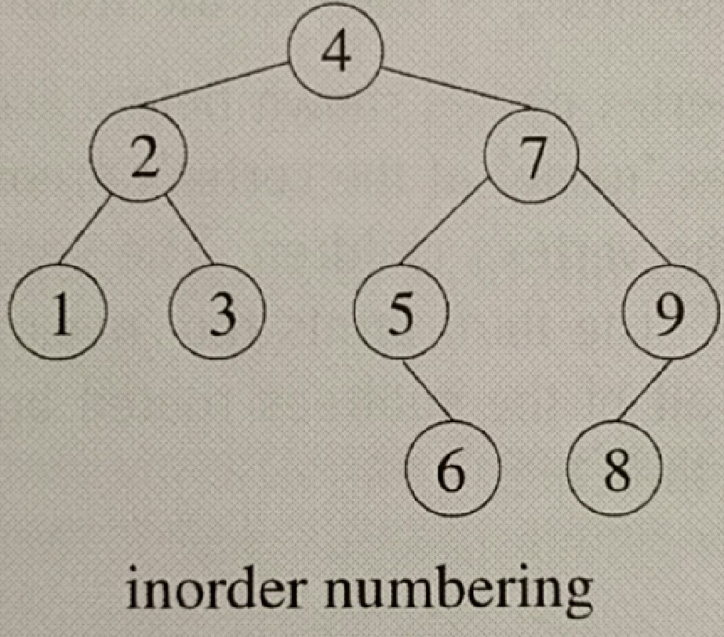

# Chapter 2: Basics of Data Structures

## Elementary data structures and their ADT abstractions

### Procedural ADTs

* __procedural ADT__: a data structure that's defined w/o code or structure
  - it's a set of data w/ fixed access utilities, such as a set

##### Stack

* __Last-In-First-Out__ (LIFO)
* methods: `push()`, `pop()`, `peek()`, `isEmpty()`, `isFull()`

##### Queue

* __First-In-First-Out__ (FIFO)
* methods: `enqueue()`, `dequeue()`

##### Double-ended queue

* deletion & insertion can occur at either end (both `front` or `back`)

##### Set

* methods: `insert()`, `delete()`, `boolean member()`, `union()` (join two sets), `find()` (find set containing that element)

##### Dictionary

* __dictionary__: records stored in sorted order, order is determined by the key fields
  * implemented using a binary search tree
* methods:
  * `search(key, D)` returns a pointer to the record(s) w/ _key_ in their key field
  * `successor(key, D)` returns a pointer to the record in dictionary D w/ the smallest key exceeding the value _key_.
  * `contains()`, `insert()`, `remove()`

##### Priority queue

* has `deleteMin()` or `deleteMax()` depending on whether it's a priority minqueue or maxqueue 
* methods:
  * `changePriority(record_name, new_key_value)` changes the priority of _record_name_ to _new_key_value_, which uses `reducePriority(record_name, new_key_value)` b/c the change is usually to a lower value

##### Mappings

* a renaming function

##### List

* procedural lists have the operations of the set, plus `successor()` & `predecessor()` operations, and maybe `insertAfter(y, x)` which inserts _y_ after _x_, `prepend(x, L)`, `append(x, L)`


### Structural ADTs

* __structural ADT__: physical models of data structures;; there's no code or fixed rules about how a structure should be built, accessed, or described

##### List

* can be implemented w/ single links, double links, circular linking, as an array, as a tuple, etc. Pretty much as anything. So versatile wow.

##### Bitmaps

* an array of bits
  
  * usually used to help you find out whether an integer is in a list
    
    ``` 
    S = (0, 4, 7, 8, 9, 10, 13, 14)
    corresponding_bitmap = BitMap[0..15]
    Bitmap[1] returns 0 b/c no 1 in the list
    Bitmap[0] returns 1 b/c 0 is in the list
    ```

##### Trees

* __free tree__, __unrooted tree__: a tree without a notion of a root; essentially a graph
  
  


## Data structures and the hazards of implementation

##### Circular queue

* __cursor__: the technical term for an array index variable
* an array with _n_ elements can be used to implement a circular queue with at most _n-1_ records
  * this allows us to distinguish the full and empty situations from each other, because front != back
  * it's at most _n-1_ unless you do an alternate implementation where you keep track of whether the last queue operation was an insertion/deletion

##### Doubly sorted back-deleting lossy queue

* a priority queue w/ the following rules:
  * must support `deleteMin()`
  * inserting a record w/ key `y` means that all values greater than `y` need to be deleted & thrown away
* example implementation: a sorted list/array, sorted from least → greatest keys
  * back deletions ensure that the queue is still sorted
  * records are also sorted by the time they were inserted in the queue
* amortized operation count for deletion is constant

##### Binary heap

* __complete binary tree__: a binary tree w/ _d_ levels has 2^(d-1) leaves

#####  

## Tree traversal

### Depth-first tree traversal

* __Depth-First-Search (DFS)__: traverses edges from vertex to vertex, starting w/ the root; if a vertex has unprocessed children, select one of them to visit next, otherwise go back up the tree to the vertex's parents, and process the other children if any
  
  * only goes back up when the entire subtree rooted by the vertex has been processed
  
* __preorder traversal__: (Node, Left to Right)
  
  processes Node, then starts at the node's right subtree and goes down, then moves onto node's left subtree once that's done, [see this img](https://github.com/chelseavalentine/Problems/raw/master/notes/img/preorder.png)
  
  This is the code for a binary tree, but you can do it for a tree; you would have a for loop over the children
  
  ``` java
  void preorderTraversal(Node node) {
    if (node == null) return;
    // process node here
    preorderTraversal(node.left);
    preorderTraversal(node.right);
  }
  ```
  
  ​
  
* __inorder traversal__: (___for binary trees only___) (Left, Node, Right)
  
  Starts at left-most node, goes up to parent, [see this img](https://github.com/chelseavalentine/Problems/raw/master/notes/img/inorder.png)
  
  
  
  ``` java
  void inorderTraversal(Node node) {
    if (node == null) return;
    inorderTraversal(node.left);
    // process current node
    inorderTraversal(node.right);
  }
  ```
  
  ​
  
* __postorder traversal__: (Left to Right, Node)
  
  left-most lowest nodes → right-most nodes → process root, [see this image](https://github.com/chelseavalentine/Problems/raw/master/notes/img/postorder.png)
  
  This is the code for a binary tree, but you can do it for a tree; you would have a for loop over the children
  
  ``` java
  void postorderTraversal(Node node) {
    postorderTraversal(node.left);
    postorderTraversal(node.right);
    // process current node
  }
  ```
  
* __code motion__: restructuring a program while preserving the logic

##### Use cases for the traversals

* postorder:
  * solution for vertex _v_ is complete @ _v_'s postorder exit time (when DFS leaves _v_ for the last time, never to return)
* preorder:
  * usually used for initialization

##### Arithmetic expression trees

* a unary `–` operator represents the negated value of its right subtree
* a postorder DFS will allow us to evaluate the tree from bottom up (Reverse Polish)
* each vertex has the field `v.op` & `v.numb`, one of them is set to null depending on the nature of the vertex
* in _Reverse Polish Notation_, we create a string listing the vertices in postorder DFS ordering
  * each operator will be applied to the 2 numbers before it
  * indicate the unary `–` operator with a `m` instead, so it isn't confused with subtraction


### Iterative depth-first tree traversal

* is done with stacks & a while loop that checks whether the stack is empty, but you would push the children onto the stack in right→ left ordering, so that you can process them left→right when you pop them off the stack


### Breadth-first tree traversal

* __Breadth-First-Search (BFS)__: visits a tree's vertices level-by-level, going top→bottom, and right→left
  
  * use cases:
    * path optimization & game search problems
  * no recursive implementations; needs an auxiliary data structure (queue) to sequence the traversals
    * when a vertex is dequeued from the front, its children are enqueued at the back
  
  ``` java
  void BFS(Node node) {
    create empty queue Q;
    insert v at back of Q;
    repeat
      x = DeleteFrontOf(Q);
    	//process vertex x
      for each child w of x, do
        insert w at back of Q
    until Q is empty
  }
  ```
  
  * enhancement: use priority queue to hold data
  
* __leaf-based bottom-up BFS__: processes the leaves first, then go up and process all of the vertices whose children are just leaves
  
  * a vertex can't be processed until all of its children are processed
  * there's also a level-based bottom-up BFS


## Tree-based DFS solution methods

### Iterative deepening: using DFS to simulate BFS (p. 99)