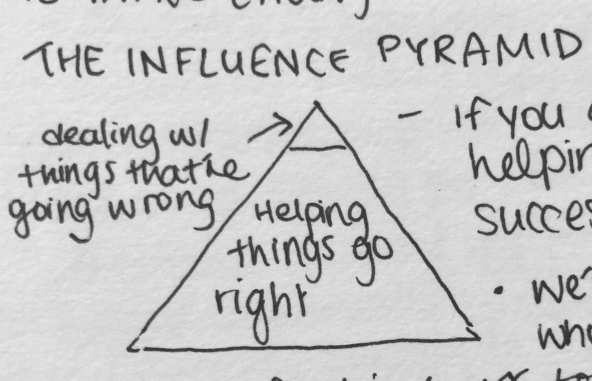
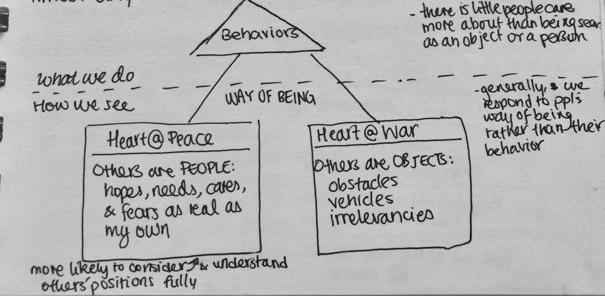

# The Anatomy of Peace: Resolving the Heart of Conflict

* to invite change in others, we have this influence pyramid:

* if you don't work on the bottom (better listening, helping, building relationships), you won't be successful at the top
* we're all surrounded by autonomous people who don't always behave as we'd like
* renowned for kindness towards allies and enemies alike

### Ch 4: Beneath behavior

Almost any behavior can be defined in two ways:

* when we see others as objects, we begin provoking them to make our lives difficult

  * instead of being passive victims of misunderstandings, we become active perpetuators of it
  * then, we both get allies (actual, perceived, or potential) as a way of feeling justified in our own accusing views of others

* the Better-Than style of justification

  | **View of Myself** | **View of Others**   |
  | ------------------ | -------------------- |
  | superior           | inferior             |
  | important          | incapable/irrelevant |
  | virtuous/right     | false/wrong          |
  | **Feelings**       | **View of World**    |
  | impatient          | competitive          |
  | disdainful         | troubled             |
  | indifferent        | needs me             |

* **when you let people go on hurting themselves/others, it's usually out of self-justification**

* the Worse-Than box

  | **View of Myself** | **View of Others** |
  | ------------------ | ------------------ |
  | not as good        | advantaged         |
  | broken/deficient   | privileged         |
  | fated              | blessed            |
  | **Feelings**       | **View of World**  |
  | helpless           | hard/difficult     |
  | jealous/bitter     | against me         |
  | depressed          | ignoring me        |

