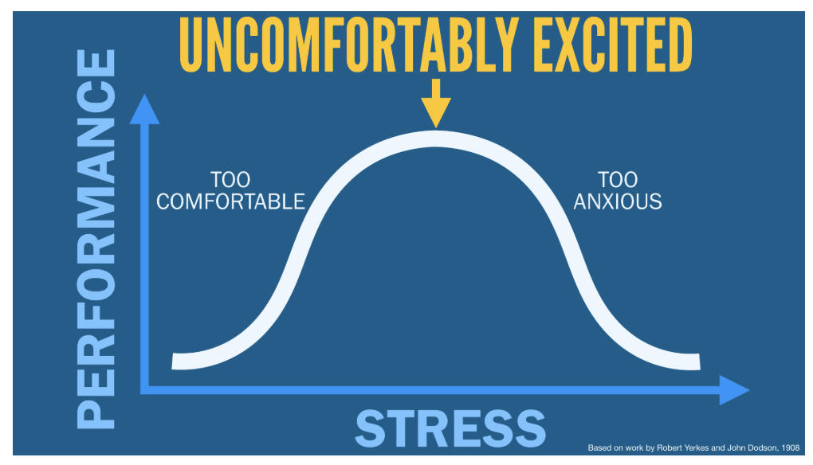

# Ken Norton's blog posts

Notes taken while reading [Ken Norton's blog](https://www.kennorton.com/).

### Blameless Post Mortems

> If you want your team to be audacious, you have to make being audacious the path of least resistance.

> Blameless doesn't just mean not blaming others, it also means not blaming yourself.

### Empathy and Product Management

#### Brené Brown on Empathy

* empathy fuels connection & sympathy drives disconnection
* rarely ever does an empathetic response begin with "at least"
* if someone shares a really difficult thing with you, it's better to say "I don't know what to say right now, I'm just so glad that you told me"
  * rarely can a response make something better, what makes something better is connection

### The Future Was Already Here

> Just as an airplane seems to move faster to an outside observer than to a passenger, it can be difficult to appreciate the pace of innovation when you're on the inside. Sometimes it's satisfying to step back and marvel.

### The Authenticity Gap: Is "being authentic" easier said than done?

> Managers must first be willing to undertake the very difficult task of self-reflection and self-examination for bias, prejudice and racism, followed by the necessary anti-racism training. only then can we be truly competent in creating an environment where we all feel safe, supported, and appreciated. People of color can very easily detect when a manager – especially a manager who is not of color – isn't genuine.

> Is a prerequisite to working in tech as a minoirty that one is expected to, in the eyes of the majority, subliminate your racial identity to ensure a cultural fit?

> Welcoming authenticity in others is even more important than finding it in yourself.

> To me, authenticity means narrowing the distance between who I am and who you _think_ I am.

### Getting the Job Done: Why judgment matters more than outcomes

* > The best poker players evaluate and improve their judgment, independent of the outcome.

* tweets on management

  * just tell them already; be blunt about what you see
  * regular one-on-ones are like oil changes; if you skip them, plan to get stranded on the side of the highway at the worst possible time
  * We talk a lot about diversity and inclusion. You, as a manager, have to force it to happen, or it won't ever

### 10x not 10%

* > It's often easier to make something 10x better than it is to make it 10% better

  * finding another 10% means using existing tools and assumptions
  * 10x improvements lean on bravery and creativity

* best pots (technically & artistically) came from the group who were graded on quantity (because of iterative learning)

* measure impact (the result of the project), not the effort (what it could take to get there)

  * "We will have accomplished this." not "We need to do that."

* > Always work on something uncomfortably exciting.

### Please make yourself uncomfortable

* write your resume for 10 years from now