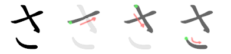
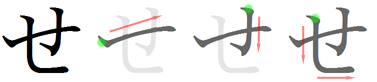
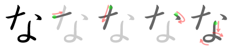
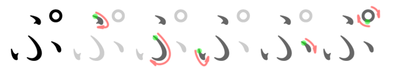
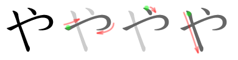
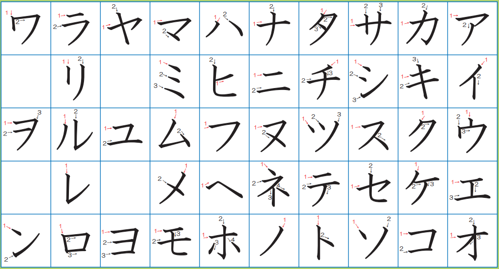

# Japanese Alphabets

## Hiragana

### Basic syllables

| **あ** | **か** |   さ   |   た   |   な   |   は   |   ま   |   や   |   ら   |    わ    |  ん  |
| :----: | :----: | :----: | :----: | :----: | :----: | :----: | :----: | :----: | :------: | :--: |
|  *a*   |  *ka*  |  *sa*  |  *ta*  |  *na*  |  *ha*  |  *ma*  |  *ya*  |  *ra*  |   *wa*   | *n*  |
| **い** | **き** | **し** | **ち** | **に** | **ひ** | **み** |        | **り** |          |      |
|  *i*   |  *ki*  | *shi*  | *chi*  |  *ni*  |  *hi*  |  *mi*  |        |  *ri*  |          |      |
| **う** | **く** | **す** | **つ** | **ぬ** | **ふ** | **む** | **ゆ** | **る** |          |      |
|  *u*   |  *ku*  |  *su*  | *tsu*  |  *nu*  |  *fu*  |  *mu*  |  *yu*  |  *ru*  |          |      |
| **え** | **け** | **せ** | **て** | **ね** | **へ** | **め** |        | **れ** |          |      |
|  *e*   |  *ke*  |  *se*  |  *te*  |  *ne*  |  *he*  |  *me*  |        |  *re*  |          |      |
| **お** | **こ** | **そ** | **と** | **の** | **ほ** | **も** | **よ** | **ろ** |  **を**  |      |
|  *o*   |  *ko*  |  *so*  |  *to*  |  *no*  |  *ho*  |  *mo*  |  *yo*  |  *ro*  | *o (wo)* |      |

### With diacritical marks

| **が** | **ざ** | **だ** | **ば** | **ぱ** |
| :----: | :----: | :----: | :----: | :----: |
|  *ga*  |  *za*  |  *da*  |  *ba*  |  *pa*  |
| **ぎ** | **じ** | **ぢ** | **び** | **ぴ** |
|  *gi*  |  *ji*  |  *ji*  |  *bi*  |  *pi*  |
| **ぐ** | **ず** | **づ** | **ぶ** | **ぷ** |
|  *gu*  |  *zu*  |  *zu*  |  *bu*  |  *pu*  |
| **げ** | **ぜ** | **で** | **べ** | **ぺ** |
|  *ge*  |  *ze*  |  *de*  |  *be*  |  *pe*  |
| **ご** | **ぞ** | **ど** | **ぼ** | **ぽ** |
|  *go*  |  *zo*  |  *do*  |  *bo*  |  *po*  |

### Double consonants

Add つ before whatever will have the double consonant, e.g.

* かった　"*katta*" (won)
* さっか　"*sakka*" (writer)
* はっぱ　"*happa*" (leaf)
* ざっし　"*zasshi*" (magazine)

### Contracted sounds

| **きゃ** | **しゃ** | **ちゃ** | **にゃ** | **ひゃ** | **みゃ** | **りゃ** | **ぎゃ** | **じゃ** | **びゃ** | **ぴゃ** |
| :------: | :------: | :------: | :------: | :------: | :------: | :------: | :------: | :------: | :------: | :------: |
|  *kya*   |  *sha*   |  *cha*   |  *nya*   |  *hya*   |  *mya*   |  *rya*   |  *gya*   |   *ja*   |  *bya*   |  *pya*   |
| **きゅ** | **しゅ** | **ちゅ** | **にゅ** | **ひゅ** | **みゅ** | **りゅ** | **ぎゅ** | **じゅ** | **びゅ** | **ぴゅ** |
|  *kyu*   |  *shu*   |  *chu*   |  *nyu*   |  *hyu*   |  *myu*   |  *ryu*   |  *gyu*   |   *ju*   |  *byu*   |  *pyu*   |
| **きょ** | **しょ** | **ちょ** | **にょ** | **ひょ** | **みょ** | **りょ** | **ぎょ** | **じょ** | **びょ** | **ぴょ** |
|  *kyo*   |  *sho*   |  *cho*   |  *nyo*   |  *hyo*   |  *myo*   |  *ryo*   |  *gyo*   |   *jo*   |  *byo*   |  *pyo*   |

### Long vowels

**い** is used to elongate "*ee*", **あ** for "*aa*", **い** for "*uu*" and "*oo*", and **お** (usually for historical reasons) for "*oo*". Sometimes, **え** is used for "*ee*".

* おばあさん　"*obaasan*"
* おじいさん　"*ojiisan*"
* すうじ　"*suuji*"
* えいが　"*eega*"
* おねえさん　"*oneesan*"
* ほうりつ　"*hooritsu*"
* とお　"*too*"

### Stroke order

(Only including the ones that I struggled to remember before)

### Hiragana vs. Katakana

* long vowels are written with regardless of the sound. if writing vertically.
  * カー　"*kaa*"
  * ケーキ　"*keeki*"
  * スキー　"*suki*"
  * ボール　"*booru*"
* katakana is used for a lot of foreign words, and there're combos with small letters to create foreign sounds
  * ウイ ("*wi*") in ハロウイーン　in "*harowiin*"
  * "*v*" is sometimes written as ヴ

## Katakana

### Basic syllables

| **ア** | **カ** | **サ** | **タ** | **ナ** | **ハ** | **マ** | **ヤ** | **ラ** |  **ワ**  | **ン** |
| :----: | :----: | :----: | :----: | :----: | :----: | :----: | :----: | :----: | :------: | :----: |
|  *a*   |  *ka*  |  *sa*  |  *ta*  |  *na*  |  *ha*  |  *ma*  |  *ya*  |  *ra*  |   *wa*   |  *n*   |
| **イ** | **キ** | **シ** | **チ** | **ニ** | **ヒ** | **ミ** |        | **リ** |          |        |
|  *i*   |  *ki*  | *shi*  | *chi*  |  *ni*  |  *hi*  |  *mi*  |        |  *ri*  |          |        |
| **ウ** | **ク** | **ス** | **ツ** | **ヌ** | **フ** | **ム** | **ユ** |   ル   |          |        |
|  *u*   |  *ku*  |  *su*  | *tsu*  |  *nu*  |  *fu*  |  *mu*  |  *yu*  |  *ru*  |          |        |
| **エ** | **ケ** | **セ** | **テ** | **ネ** | **ヘ** | **メ** |        | **レ** |          |        |
|  *e*   |  *ke*  |  *se*  |  *te*  |  *ne*  |  *he*  |  *me*  |        |  *re*  |          |        |
| **オ** | **コ** | **ソ** | **ト** | **ノ** | **ホ** | **モ** | **ヨ** | **ロ** |  **ヲ**  |        |
|  *o*   |  *ko*  |  *so*  |  *to*  |  *no*  |  *ho*  |  *mo*  |  *yo*  |  *ro*  | *o (wo)* |        |

### With diacritical marks

| **ガ** | **ザ** | **ダ** | **バ** | **パ** |
| :----: | :----: | :----: | :----: | :----: |
|  *ga*  |  *za*  |  *da*  |  *ba*  |  *pa*  |
| **ギ** | **ジ** | **デ** | **ビ** | **ピ** |
|  *gi*  |  *ji*  |  *ji*  |  *bi*  |  *pi*  |
| **グ** | **ズ** | **ヅ** | **ブ** | **プ** |
|  *gu*  |  *zu*  |  *zu*  |  *bu*  |  *pu*  |
| **ゲ** | **ゼ** | **デ** | **ベ** | **ペ** |
|  *ge*  |  *ze*  |  *de*  |  *be*  |  *pe*  |
| **ゴ** | **ゾ** | **ド** | **ボ** | **ポ** |
|  *go*  |  *zo*  |  *do*  |  *bo*  |  *po*  |

### Contracted sounds

| **キャ** | **シャ** | **チャ** | **ニャ** | **ヒャ** | **ミャ** | **リャ** | **ギャ** | **ジャ** | **ビャ** | **ピャ** |
| :------: | :------: | :------: | :------: | :------: | :------: | :------: | :------: | :------: | :------: | :------: |
|  *kya*   |  *sha*   |  *cha*   |  *nya*   |  *hya*   |  *mya*   |  *rya*   |  *gya*   |   *ja*   |  *bya*   |  *pya*   |
| **キュ** | **シュ** | **チュ** | **ニュ** | **ヒュ** | **ミュ** | **リュ** | **ギュ** | **ジュ** | **ビュ** | **ピュ** |
|  *kyu*   |  *shu*   |  *chu*   |  *nyu*   |  *hyu*   |  *myu*   |  *ryu*   |  *gyu*   |   *ju*   |  *byu*   |  *pyu*   |
| **キョ** | **ショ** | **チョ** | **ニョ** | **ヒョ** | **ミョ** | **リョ** | **ギョ** | **ジョ** | **ビョ** | **ピョ** |
|  *kyo*   |  *sho*   |  *cho*   |  *nyo*   |  *hyo*   |  *myo*   |  *ryo*   |  *gyo*   |   *jo*   |  *byo*   |  *pyo*   |

### Stroke order

