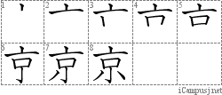

# Kanji: Lesson 7-8

Chinese/Japanese refer to the Chinese-based or native Japanese pronunciation(s).

## Lesson 7: Family picture (かぞくのしゃしん)

京 (capital)
* Chinese: **きょう**
* 

子 (child)
* Chinese: し
* Japanese: **こ**
* 

小 (small)
* Chinese: しょう
* Japanese: **ちい**
* 

会 (to meet)
* Chinese: **かい**
* Japanese: **あ**
* 

社 (company)
* Chinese: **しゃ**、じゃ
* 

父 (father)
* Chinese: ふ
* Japanese: **ちち**、**とう**
* 

母 (mother)
* Chinese: ぼ
* Japanese: **はは**、**かあ**
* 

高 (high)
* Chinese: **こう**
* Japanese: **たか**
* 

校 (school)
* Chinese: **こう**
* 

毎 (every)
* Chinese: **まい**
* 

語 (word)
* Chinese: **ご**
* 

文 (sentence)
* Chinese: **ぶん**

帰 (to return)
* Chinese: き
* Japanese: **かえ**
* 

入 (to enter)
* Chinese: にゅう
* Japanese: **はい**、い、いり

## Lesson 8: Barbecue (バーベーキュー)

員 (member)
* Chinese: **いん**
* 

新 (new)
* Chinese: **しん**
* Japanese: **あたら**
* 

聞 (to listen)
* Chinese: **ぶん**
* Japanese: **き**
* 

作 (to make)
* Chinese: さく
* Japanese: **つく**
* 

仕 (to serve)
* Chinese: **し**
* Japanese: つか

事 (thing)
* Chinese: じ
* Japanese: **ごと**、こと
* 

電 (electricity)
* Chinese: **でん**
* 

車 (car)
* Chinese: **しゃ**
* Japanese: **くるま**
* 

休 (to rest)
* Chinese: きゅう
* Japanese: **やす**
* 

言 (to say)
* Chinese: げん
* Japanese: **い**、こと
* 

読 (to read)
* Chinese: どく
* Japanese: **よ**
* 

思 (to think)
* Chinese: し
* Japanese: **おも**
* 

次 (next)
* Chinese: じ
* Japanese: **すぎ**

何 (what)
* Japanese: **なん**、**なに**
* 
