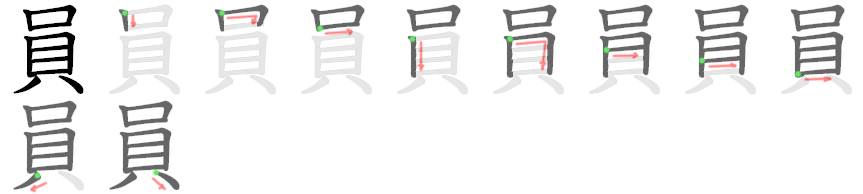
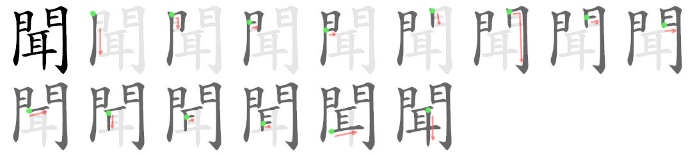
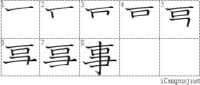
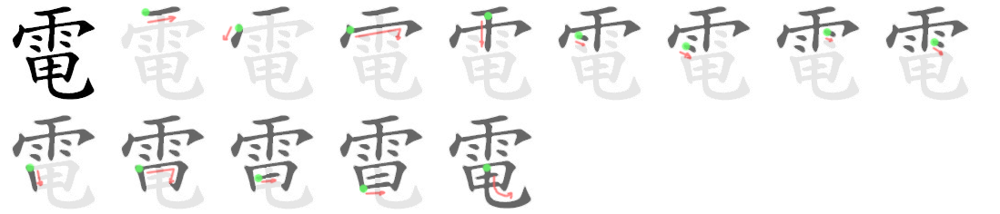
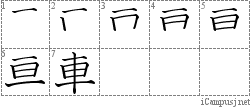
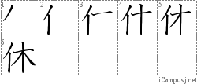
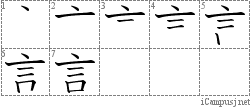
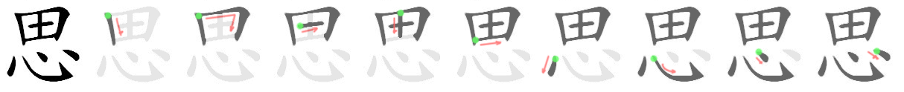
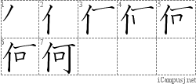

# Kanji: Lesson 8

Chinese/Japanese refer to the Chinese-based or native Japanese pronunciation(s).

## Lesson 8: Barbecue (バーベーキュー)

員 (member)
* Chinese: **いん**
* 

新 (new)
* Chinese: **しん**
* Japanese: **あたら**
* 

聞 (to listen)
* Chinese: **ぶん**
* Japanese: **き**
* 

作 (to make)
* Chinese: さく
* Japanese: **つく**
* 

仕 (to serve)
* Chinese: **し**
* Japanese: つか

事 (thing)
* Chinese: じ
* Japanese: **ごと**、こと
* 

電 (electricity)
* Chinese: **でん**
* 

車 (car)
* Chinese: **しゃ**
* Japanese: **くるま**
* 

休 (to rest)
* Chinese: きゅう
* Japanese: **やす**
* 

言 (to say)
* Chinese: げん
* Japanese: **い**、こと
* 

読 (to read)
* Chinese: どく
* Japanese: **よ**
* 

思 (to think)
* Chinese: し
* Japanese: **おも**
* 

次 (next)
* Chinese: じ
* Japanese: **すぎ**

何 (what)
* Japanese: **なん**、**なに**
* 
