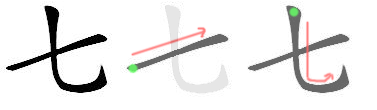
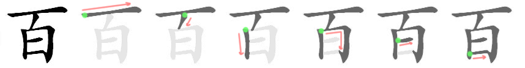
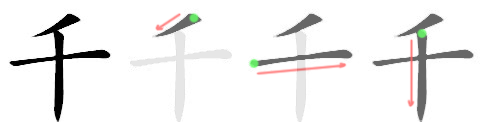
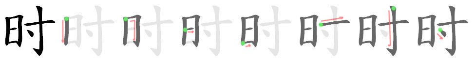

# Kanji

## Lesson 1: Daily life (毎日の生活)

* 一 (one)
  - *Chinese-based pronunciation(s):* **いち**、いつ
  - *Native Japanese pronunciation(s):* ひと
* 二 (two)
  - *Chinese-based pronunciation(s):* **に**
  - *Native Japanese pronunciation(s):* ふた
* 三 (three)
  - *Chinese-based pronunciation(s):* **さん**
  - *Native Japanese pronunciation(s):* みっ
* 四 (four)
  - *Chinese-based pronunciation(s):* し
  - *Native Japanese pronunciation(s):* **よん**、**よ**、よっ
  - 
* 五 (five)
  - *Chinese-based pronunciation(s):* **ご**
  - *Native Japanese pronunciation(s):* いつ
  - 
* 六 (six)
  - *Chinese-based pronunciation(s):* **ろく**、**ろっ**
  - *Native Japanese pronunciation(s):* むっ
  - 
* 七 (seven)
  - *Chinese-based pronunciation(s):* **しち**
  - *Native Japanese pronunciation(s):* **なな**
  - 
* 八 (eight)
  - *Chinese-based pronunciation(s):* **はち**、**はっ**
  - *Native Japanese pronunciation(s):* やつ
  - 
* 九 (nine)
  - *Chinese-based pronunciation(s):* **きゅう**、**く**
  - *Native Japanese pronunciation(s):* ここの
  - 
* 十 (ten)
  - *Chinese-based pronunciation(s):* **じゅう**、じゅっ、じっ
  - *Native Japanese pronunciation(s):* とお
* 百 (hundred)
  - *Chinese-based pronunciation(s):* **ひゃく**、**びゃく**、**ぴゃく**
  - 
* 千 (thousand)
  - *Chinese-based pronunciation(s):* **せん**、**ぜん**
  - 
* 万 (ten thousand)
  - *Chinese-based pronunciation(s):* **まん**
  - 
* 円 (yen; circle)
  - *Chinese-based pronunciation(s):* **えん**
  - *Native Japanese pronunciation(s):* まろ
* 時 (time)
  - *Chinese-based pronunciation(s):* **じ**
  - *Native Japanese pronunciation(s):* とき
  - 

## Lesson 2: Mary's weekend (メアリーさんのしゅうまつ)

* 時 (day; sun)
  - *Chinese-based pronunciation(s):* 
  - *Native Japanese pronunciation(s):* 
  - stroke order

- 時 (book; basis)
  - *Chinese-based pronunciation(s):* 
  - *Native Japanese pronunciation(s):* 
  - stroke order

- 時 (person)
  - *Chinese-based pronunciation(s):* 
  - *Native Japanese pronunciation(s):* 
  - stroke order

- 時 (moon; month)
  - *Chinese-based pronunciation(s):* 
  - *Native Japanese pronunciation(s):* 
  - stroke order

- 時 (fire)
  - *Chinese-based pronunciation(s):* 
  - *Native Japanese pronunciation(s):* 
  - stroke order

- 時 (water)
  - *Chinese-based pronunciation(s):* 
  - *Native Japanese pronunciation(s):* 
  - stroke order

- 時 (tree)
  - *Chinese-based pronunciation(s):* 
  - *Native Japanese pronunciation(s):* 
  - stroke order

- 時 (gold; money)
  - *Chinese-based pronunciation(s):* 
  - *Native Japanese pronunciation(s):* 
  - stroke order

- 時 (soil)
  - *Chinese-based pronunciation(s):* 
  - *Native Japanese pronunciation(s):* 
  - stroke order

- 時 (up)
  - *Chinese-based pronunciation(s):* 
  - *Native Japanese pronunciation(s):* 
  - stroke order

- 時 (down)
  - *Chinese-based pronunciation(s):* 
  - *Native Japanese pronunciation(s):* 
  - stroke order

- 時 (middle)
  - *Chinese-based pronunciation(s):* 
  - *Native Japanese pronunciation(s):* 
  - stroke order

- 時 (half)
  - *Chinese-based pronunciation(s):* 
  - *Native Japanese pronunciation(s):* 
  - stroke order

- 時 (weekday)
  - *Chinese-based pronunciation(s):* 
  - *Native Japanese pronunciation(s):* 
  - stroke order

