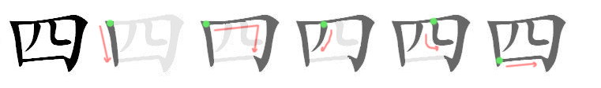
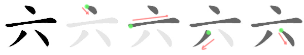
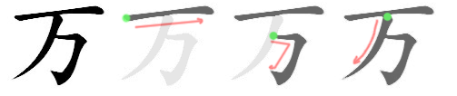

# Kanji

## Lesson 1: Daily life (毎日の生活)

一 (one)
* *Chinese-based pronunciation(s):* **いち**、いつ
* *Native Japanese pronunciation(s):* ひと

二 (two)
* *Chinese-based pronunciation(s):* **に**
* *Native Japanese pronunciation(s):* ふた

三 (three)
* *Chinese-based pronunciation(s):* **さん**
* *Native Japanese pronunciation(s):* みっ

四 (four)
* *Chinese-based pronunciation(s):* し
* *Native Japanese pronunciation(s):* **よん**、**よ**、よっ
* 
  
五 (five)
* *Chinese-based pronunciation(s):* **ご**
* *Native Japanese pronunciation(s):* いつ
* 

六 (six)
* *Chinese-based pronunciation(s):* **ろく**、**ろっ**
* *Native Japanese pronunciation(s):* むっ
* 

七 (seven)
* *Chinese-based pronunciation(s):* **しち**
* *Native Japanese pronunciation(s):* **なな**
* 

八 (eight)
* *Chinese-based pronunciation(s):* **はち**、**はっ**
* *Native Japanese pronunciation(s):* やつ
* 

九 (nine)
* *Chinese-based pronunciation(s):* **きゅう**、**く**
* *Native Japanese pronunciation(s):* ここの
* 

十 (ten)
* *Chinese-based pronunciation(s):* **じゅう**、じゅっ、じっ
* *Native Japanese pronunciation(s):* とお

百 (hundred)
* *Chinese-based pronunciation(s):* **ひゃく**、**びゃく**、**ぴゃく**
* 

千 (thousand)
* *Chinese-based pronunciation(s):* **せん**、**ぜん**
* 

万 (ten thousand)
* *Chinese-based pronunciation(s):* **まん**
* 

円 (yen; circle)
* *Chinese-based pronunciation(s):* **えん**
* *Native Japanese pronunciation(s):* まろ

時 (time)
* *Chinese-based pronunciation(s):* **じ**
* *Native Japanese pronunciation(s):* とき
* 
