# Kanji

Chinese/Japanese refer to the Chinese-based or native Japanese pronunciation(s).

## Lesson 1: Daily life (毎日の生活)

一 (one)
* Chinese: **いち**、いつ
* Japanese: ひと

二 (two)
* Chinese: **に**
* Japanese: ふた

三 (three)
* Chinese: **さん**
* Japanese: みっ

四 (four)
* Chinese: し
* Japanese: **よん**、**よ**、よっ
* 

五 (five)
* Chinese: **ご**
* Japanese: いつ
* 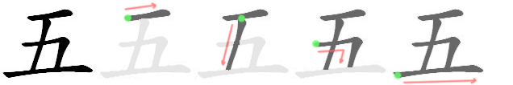

六 (six)
* Chinese: **ろく**、**ろっ**
* Japanese: むっ
* 

七 (seven)
* Chinese: **しち**
* Japanese: **なな**
* 

八 (eight)
* Chinese: **はち**、**はっ**
* Japanese: やつ
* 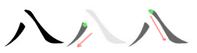

九 (nine)
* Chinese: **きゅう**、**く**
* Japanese: ここの
* 

十 (ten)
* Chinese: **じゅう**、じゅっ、じっ
* Japanese: とお

百 (hundred)
* Chinese: **ひゃく**、**びゃく**、**ぴゃく**
* 

千 (thousand)
* Chinese: **せん**、**ぜん**
* 

万 (ten thousand)
* Chinese: **まん**
* 

円 (yen; circle)
* Chinese: **えん**
* Japanese: まろ

時 (time)
* Chinese: **じ**
* Japanese: とき
* 

## Lesson 2: Mary's weekend (メアリーのしゅうまつ)

日 (day; sun)
* Chinese: **に**、**にち**、にっ
* Japanese: **び**、ひ、か
* 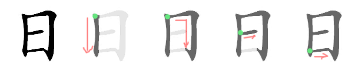

本 (book; basis)
* Chinese: **ほん**
* Japanese: もと
* 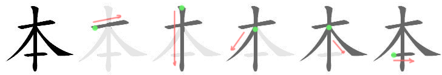

月 (moon; month)
* Chinese: **げつ**、**がつ**
* Japanese: つき
* 

水 (water)
* Chinese: **すい**
* Japanese: **みず**
* 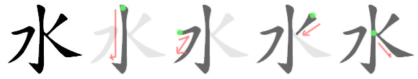

金 (gold; money)
* Chinese: **きん**
* Japanese: かね
* 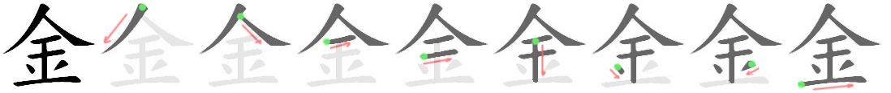

火 (fire)
* Chinese: **か**
* Japanese: ひ、び
* 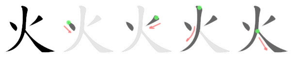

木 (tree)
* Chinese: **もく**
* Japanese: き

土 (soil)
* Chinese: **ど**、と
* Japanese: つち
* 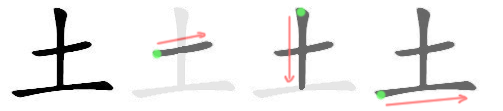

人 (person)
* Chinese: **じん**、にん
* Japanese: **ひと**
* 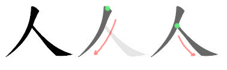

上 (up)
* Chinese: じょう
* Japanese: **うえ**、のぼ
* 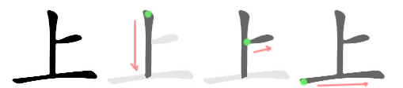

下 (down)
* Chinese: か
* Japanese: **した**、くだ
* 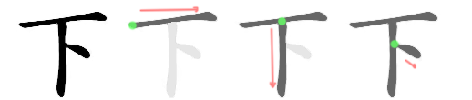

中 (half)
* Chinese: は**ん**
* 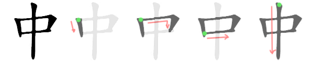

半 (middle)
* Chinese: ちゅう、じゅう
* Japanese: **なか**
* 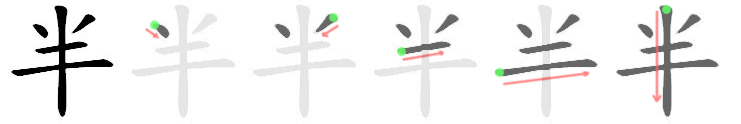

曜 (weekday)
* Chinese: **よう**
* 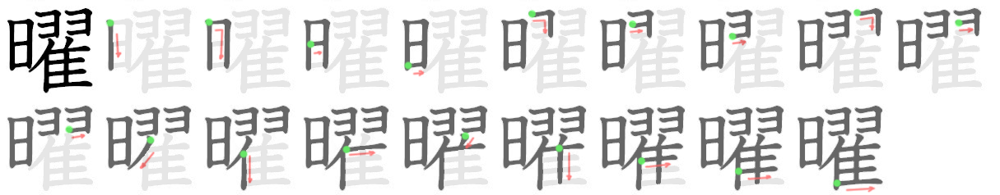

## Lesson 3: Travel (りょこう)

山 (mountain)
* Chinese: さん
* Japanese: **やま**
* 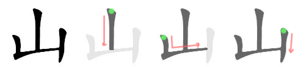

川 (river)
* Japanese: **かわ**、がわ

元 (origin)
* Chinese: **げん**、がん
* Japanese: もと
* 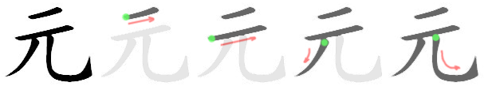

気 (spirit)
* Chinese: **き**
* 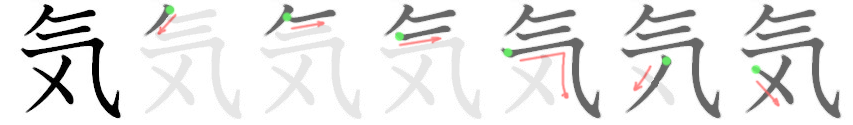

天 (heaven)
* Chinese: **てん**
* 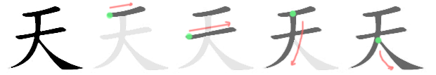

私 (I; private)
* Chinese: し
* Japanese: **わたし**
* 

今 (now)
* Chinese: こん
* Japanese: **いま**
* 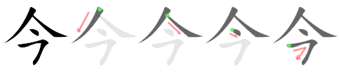

田 (rice field)
* Japanese: **た**、**だ**
* 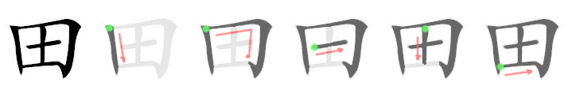

女 (woman)
* Chinese: じょ
* Japanese: **おんな**
* 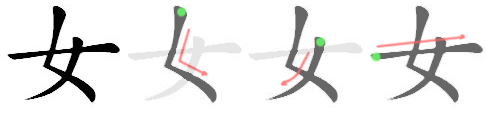

男 (man)
* Chinese: だん
* Japanese: **おとこ**
* 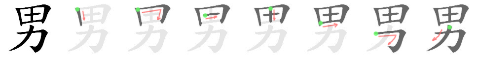

見 (to see)
* Chinese: けん
* Japanese: **み**
* 

行 (to go)
* Chinese: こう、ぎょう
* Japanese: **い**
* 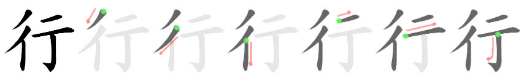

食 (to eat)
* Chinese: しょく
* Japanese: **た**
* 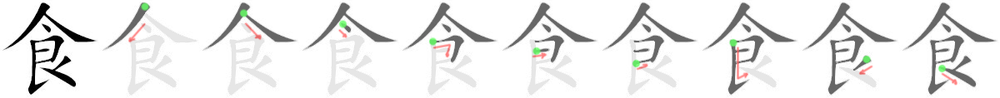

飲 (to drink)
* Chinese: いん
* Japanese: **の**
* 

## Lesson 4: My Favorite Restaurant (わたしのすきなレストラン)

東 (east)
* Chinese: とう
* Japanese: **ひがし**
* 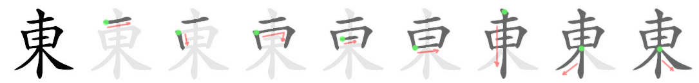

西 (west)
* Chinese: せい、さい
* Japanese: **にし**
* 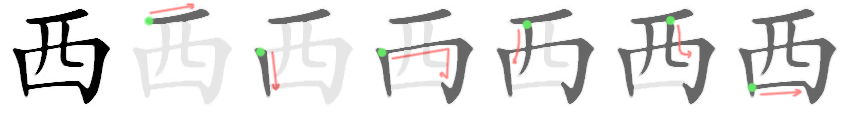

北 (north)
* Chinese: ほく、ほっ
* Japanese: **きた**
* 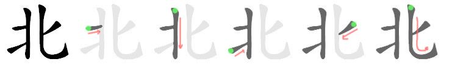

南 (south)
* Chinese: なん
* Japanese: **みなみ**
* 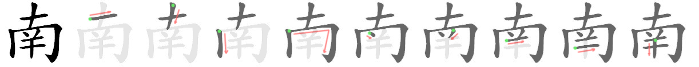

口 (mouth)
* Chinese: こう
* Japanese: **ぐち**、くち
* 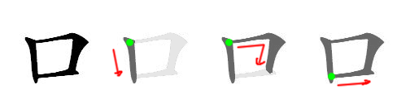

出 (to exit)
* Chinese: しゅつ、しゅっ
* Japanese: **で**、だ
* 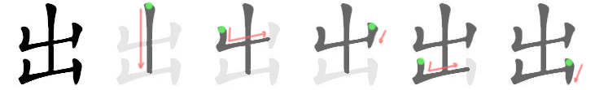

右 (right)
* Chinese: う、ゆう
* Japanese: **みぎ**
* 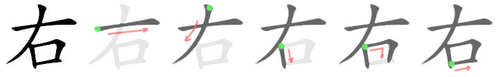

左 (left)
* Chinese: さ
* Japanese: **ひだり**
* 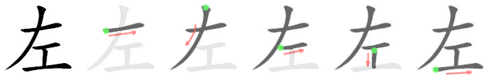

分 (minute; to divide)
* Chinese: **ふん**、**ぷん**、ふん
* Japanese: わ
* 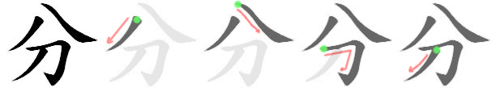

先 (ahead)
* Chinese: **せん**
* Japanese: さき
* 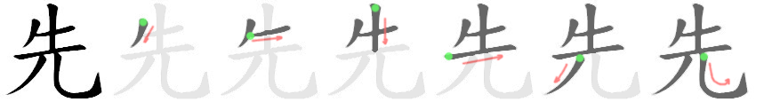

生 (birth)
* Chinese: **せい**、しょう
* Japanese: う
* 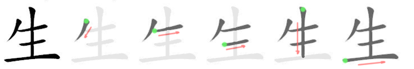

大 (big)
* Chinese: **だい**、たい
* Japanese: **おお**
* 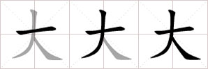

学 (learning)
* Chinese: **がく**、がっ
* Japanese: まな
* 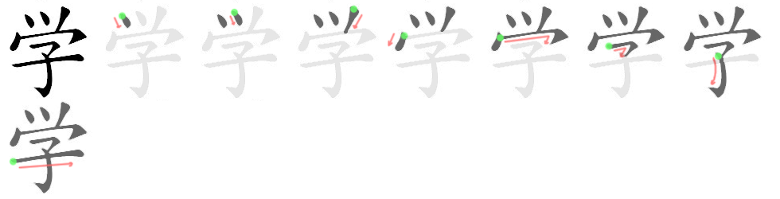

外 (outside)
* Chinese: **がい**
* Japanese: そと
* 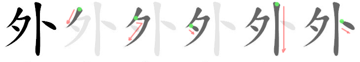

国 (country)
* Chinese: **こく**、**ごく**、こっ
* Japanese: くに
* 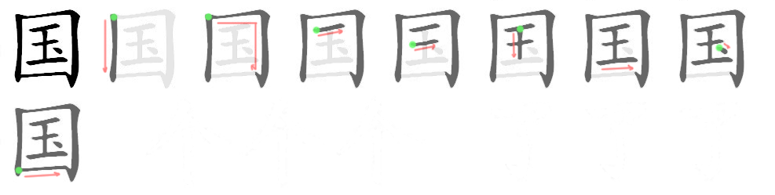

