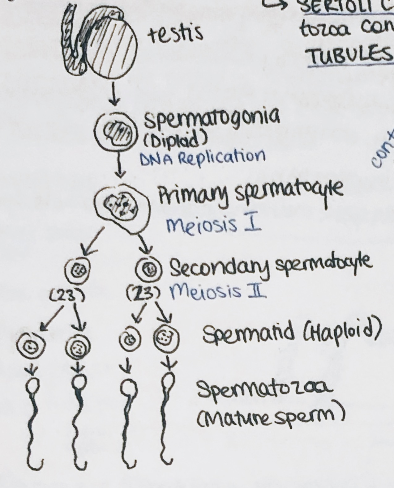
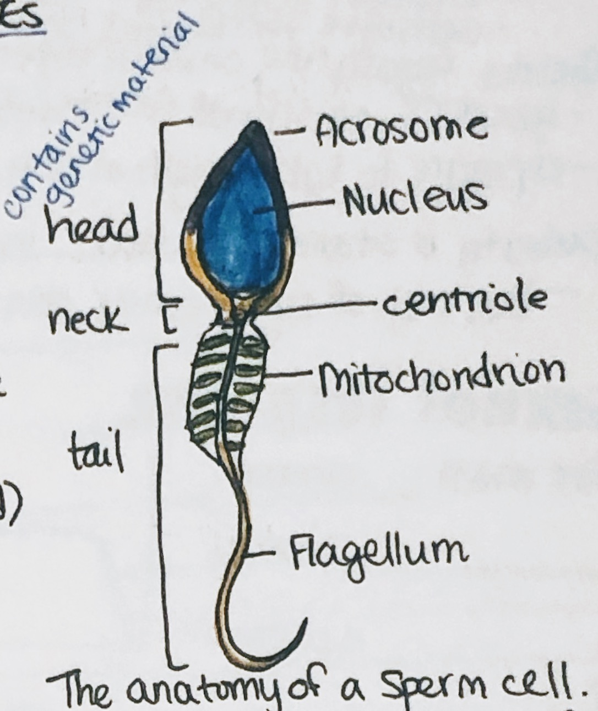

# Gametes and Fertilization

* **"ploidy"** refers to the number of chromosomes

### Spermatogenesis

* **spermatogenesis** occurs in the testes and starts at puberty
  * **sertoli cells** facilitate the germ cell to **spermatozoa** conversion, within the **seminiferous tubules**

#### The anatomy of a sperm cell

* something like 40% of sperm is formed with a normal structure, and the rest are deformed
* of the 180 million sperm per ejaculate, 100-2,000 reach the oviduct, and 20-200 reach the egg
* **acrosomal reaction** occurs when sperm binds to the egg's **zona pellucida** (shell)
  * the sperm's calcium activates the oocyte, stimulating development

