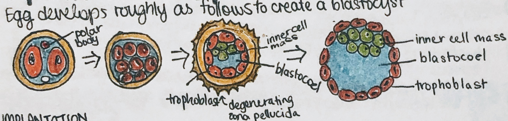

# Pregnancy and Embryo Development

### Implantation and placentation

The egg develops roughly as follows to create a blastocyst:

Implantation:

Finally, the egg is implanted:

* with singleton/fraternal twins, either 2 eggs are fertilized and can have separate chorionic sacs, or they can share one sac
* with identical (monochorionic)/monozygotic twins, they could've had a split from a faulty hatching out of the zona pellucida
  * they share 1 chorion with 2 amnions

### Newborn probabilities

* of 100 fertilized eggs...
  * 70 implant in the uterus, but of these...
    * 14 miscarriages (20% of implants)
    * 1 stillborn
    * 55  newborns (9% of implants)
      * 1 w/ major cogenital defect (2% of newborns)
      * 6 with minor defects (11% of newborns)
      * 48 healthy babies (87% of newborns)
  * 30 fail to implant

### Placenta

* the fetus doesn't have estrodiol – only estriol; the mother supplies the baby with cholestoral, which can become progesterone -> dehydroepiandrosterone -> … -> estriol
* the mother has high hCG at the beginning of the pregnancy, with moderate progesterone
  * at 10 weeks onward, the total estrogen, hPL, and placental weight start increasing
* the embryo becomes a fetus and it sits in the amniotic cavity, attached by an umbilical cord
* early issues with heart, eyes, legs, arms, ears, and teeth lead to major morphological abnormalities (2-8 weeks)
* from 9-38 weeks, any issues with lead to psychological defects and minor morphological abnormalities
  * because the baby is developing its central nervous system, eyes, teeth, palate, external genitalia, and ears
* during development, the placenta acts as a lung and liver for the fetus
* the cervix is tough during pregnancy, but softens and is more stretchy towards the time of labor

### Labor

* the maturation of the fetal adrenal gland is the classic signal for labor starting
  * progesterone usually blocks labor until term, but has no effect after this (progesterone withdrawal hypothesis)