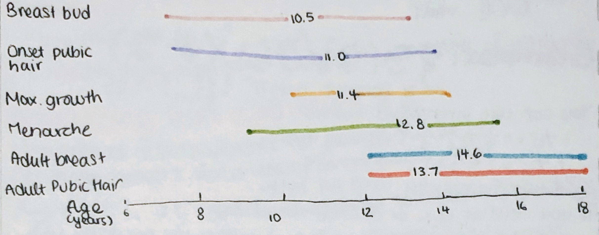
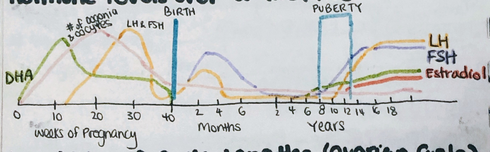
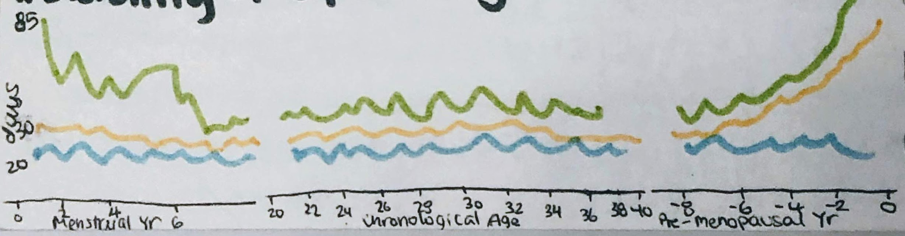
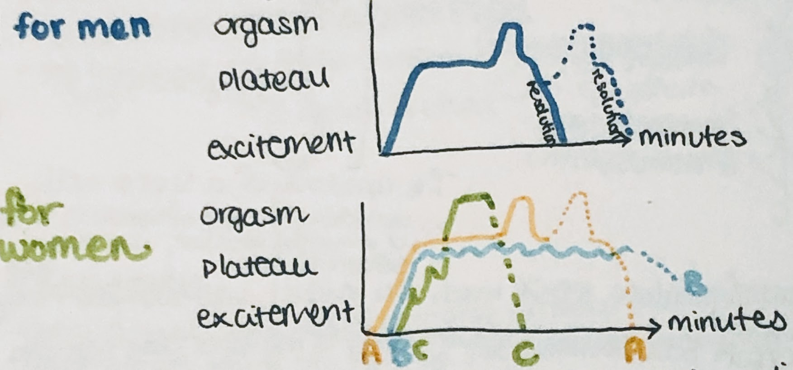

# Puberty and Sexual Response

* **thelarche:** development of breasts
* **andrenarche/pubarche:** development of axillary and public hair
* **menarch:** the onset of menstrual periods
* the LH increases during sleep causes more development

### Phases of development

### Tanner staging of puberty

* public hair development and breast development in girls
* penis enlargement, testes descension, and pubic hair in boys

### Hormone levels over a lifetime

### Instability of cycle lengths (Ovarian cycle)

### Pubertal timing

* the completion of the hypothalamic-pituitary-gonadal interplay cause gonadotrophins to rise, which drives gonads to secrete sex steroids
  * sex steroids (estrogen and testosterone) lead to GnRH secretion, and as desensitization to sex steroids occurs, the person enters puberty
    * gonadotrophin inhibition increases, requiring more steroids to suppress FSH and LH
    * a sensitive gonadostat blocks puberty
* factors regulating the onset of puberty:
  * genetics, emotional factors, nutritional status, body composition
  * exposure to light/length of the day, environment, altitude
* puberty is starting earlier! implications:
  * increased risk of breast cancer, polycystic ovarian syndrome, metabolic syndrome

### Sexual response

* the **Kinsey adult heterosexual-homosexual continuum** indicates that we all have different proportions of hetero- and homosexual behavior
* parts of the brain involved in sexual responses/sex steroid receptors:
  * prefrontal cortex (thinking)
  * smell brain (pheromones)
  * amygdala (emotions)
  * oxytocin (vasopressin; is released during sex = reward)
  * motor and sensory cortex (incoming sensations and outgoing muscle actions)
  * hypothalamus (control tower for regulating hormonal responses and the automatic nervous system)
* sex steroids drive _both_ the central (brain) responses and the sexual responses
  * libido (thought) from estrogen, and aggression from androgen