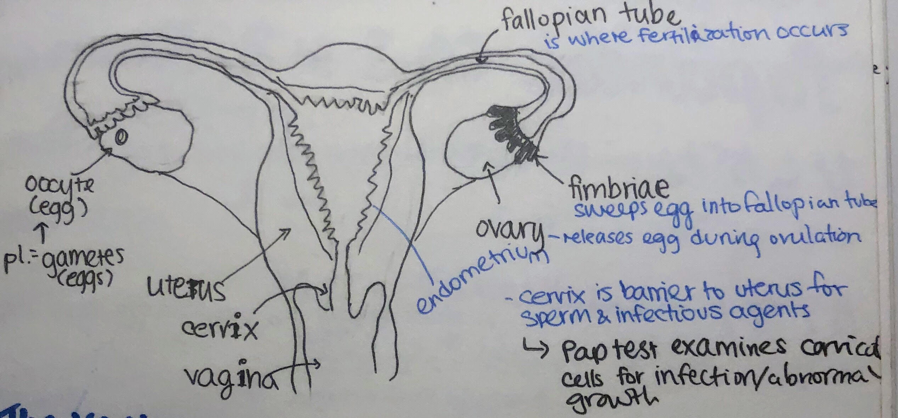

# The Female Reproduction System

### The vagina

* has muscular walls to expand and contract, and is lined with **mucous membranes** to keep it moist and protected
* 3 purposes:
  1. transport sperm to the uterus and fallopian tubes
  2. function as the birth canal
  3. allow menstrual secretions to be excreted

### The uterus

* the uterus contains the strongest muscles in the female body
* fallopian tubes connect the uterus to the **ovaries** (producer, storer, and releaser of gametes into the fallopian tubes during **ovulation**)
  * ovaries release an egg/ova and the fimbriae sweep them into the fallopian tube
    * tiny hairs (**cilia**) move them towards the uterus
* if fertilization does not occur within the fallopian tube, the ovum disintegrates and leaves the body 2 weeks later during menstruation

### Oogenesis

* **oogenesis:** process where the primary egg cell (**oocyte**) matures into an **ovum**
* the first meiotic division of the oocyte cells occur before birth, but all eggs are in prophase I of meiosis, arrested until puberty/sexual adulthood
* before ovulation, the nucleus within the primary oocyte splits so half of the chromosomes go to one cell, and half to another; the larger oocyte is called the **secondary oocyte**
  * smaller cell is called the **polar body**, which disintegrates and dies; it can't be fertilized
  * the secondary oocyte grows in the ovary until matured, and is then released and goes through the fallopian tubes