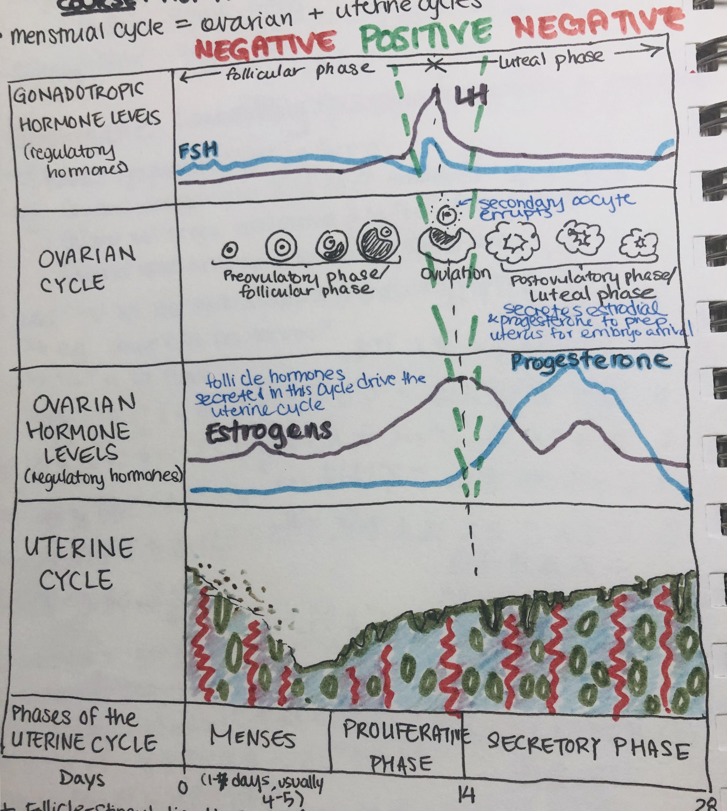
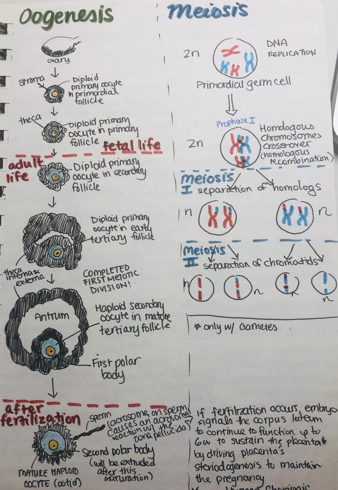

# The Menstrual Cycle

* menstrual cycle = ovarian + uterine cycles

* **Follicle-Stimulating Hormone (FSH)**
* **Luteinizing Hormone (LH)**
* the luteal phase and menses' duration is standard regardless of the cycle's length
  * the follicular phase's length determines the length of the menstrual cycle the most (25/28/35 days)
* **steroidogenesis** within the ovary: cholesterol (27 carbons) => androgens (19C) => estrogen (18C) <=> testosterone (19C)
  * less carbon = 10-1000x more potency
* rising and low estrogen negatively inhibits GnRH, causing FSH and LH to build up in the anterior pituitary. High levels of estrogen causes a spike in LH, which causes the follicle to rupture

* if fertilization occurs, the embryo signals to the corpus luteum to continue to function up to 6 weeks to sustain the placenta by driving the placenta's steriodogenesis to maintain the pregnancy
  * now **Human Chorionic Gonadotrophin (hCG)** is initially made by the fetus, and then the placenta throughout the pregnancy

