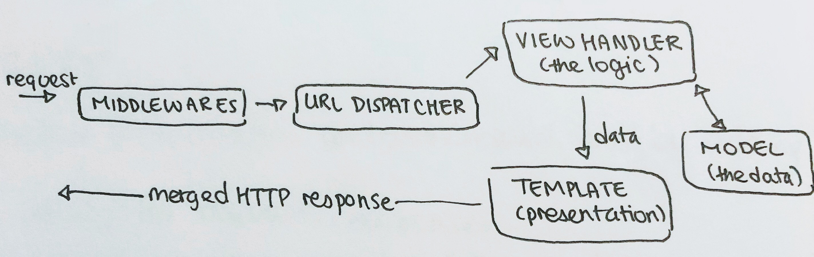
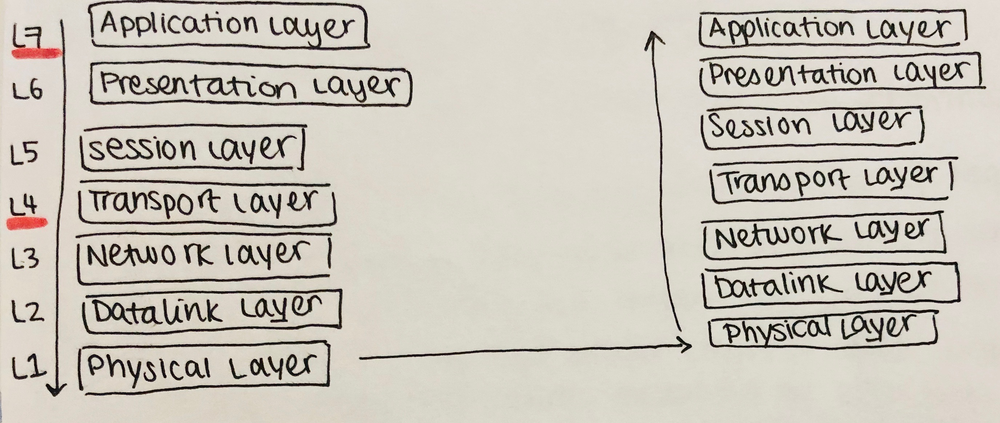

# Large-Scale Web Apps

Notes on the Large-Scale Web Apps course at NYU.

### Introduction to scalability

* scalability: the capability of a system to maintain performance under increased load by adding more resources
  * system: a web service providing users utility with requests/responses
  * **performance:** not crashing under load; available to serve new requests; the latency
    * **latency:** responding in a certain amount of time
  * **load:** a function of the user count (types of load: write- or read-intensive)
  * **resources:**
    * computing power, measured by CPUs/core
    * memory
    * number of physical machines
    * number and type of secondary storages (spinning disks, solid state drives, i.e. SSDs)
    * network bandwidth
    * cooling
    * power
    * disk bandwidth
* **vertical scaling:** making a single node more powerful
  * e.g. more/better CPUs, faster clock rate, more memory, larger disks, more/faster caches
* **horizontal scaling:** adding more machines (nodes) to the system
  * this often means using commodity machines, connected to form a cluster, with pooled resources

#### Vertical vs. horizontal scaling

* vertical scaling...
  * doesn't address high availability (HA) because you need 2 of everything
  * is costly
  * bounded by physical realities
  * can't scale down dynamically (e.g. during low-activity periods)
* **linear scaling:** when amount of resources required to maintain the service level grows proportionally to the load (not necessarily 1 to 1 ratio)
  * **super linear:** scaling greater than a 1-to-1 ratio

### Object-relational mapping (ORM)

#### Object-oriented vs. relational data models

* object-oriented models
  * strong support by programming languages
  * works well with object databases
  * no standard persistence mechanism
  * object hierarchy by compositions (objects in objects)
* relational data models
  * used by most Database Management Systems (DBMS)
  * basic data types reside in relations/tables
  * very good for persisting data
  * strong theoretical foundations (relational algebra)
  * no hierarchy; uses table relationships

#### Disadvantages of ORM

* is complicated when you need to consider  complex relationships
* obscures implementation, therefore it's harder to reason about importance

#### Django

* an ORM can hinder scaling
* no good support for horizontal partitioning
* Model-View-Controller

### Back-of-the-envelope calculations

* 2^10 = 1,024, which is approximately 1,000

#### Orders of magnitude

#### Decimal system

* 1000^1 bytes (10^3): kilobyte (KB)
* 1000^2 bytes (10^6): megabyte (MB)
* 1000^3 bytes (10^9): gigabyte (GB)
* 1000^4 bytes (10^12): terabyte (TB)
* 1000^5 bytes (10^15): petabyte (PB)
* 1000^6 bytes (10^18): exabyte (EB)

#### Binary system

* 1024^1 bytes (2^10): kibibyte (kiB)
* 1024^2 bytes (2^20): mebibyte (MiB)
* 1024^3 bytes (2^30): gibibyte (GiB)
* 1024^4 bytes (2^40): tebibyte (TiB)
* 1024^5 bytes (2^50): pebibyte (PiB)
* 1024^6 bytes (2^60): exbibyte (EiB)

#### Durations (latency)

* 1000^0 (10^0) seconds: second(s)
* 1000^-1 (10^-3) seconds: millisecond (ms)
* 1000^-2 (10^-6) seconds: microsecond (μ, usec)
* 1000^-3 (10^-9) seconds: nanosecond (ns)
* 1000^-4 (10^-12) seconds:  picosecond (ps)

#### Numbers everyone should know

* L1 cache reference: 0.5ns
* branch mispredict: 5ns
* L2 cache reference: 7ns
* mutex lock/unlock: 25ns
* main memory reference: 100ns
* compress 1k bytes with zippy: 3,000ns
* send 2k bytes over 1Gbps network: 20,000ns
* reading 1MB sequentially from memory: 250,000ns
* round-trip within the same datacenter: 500,000ns
* disk seek: 10,000,000ns
* read 1MB sequentially from disk: 20,000,000ns
* send a packet from CA -> Netherlands -> CA: 150,000,000ns

### Performance

#### Performance metrics: First order

* captures things visible to the end user
* **latency:** how long it takes to complete an action/request
* **availability/uptime:** the server being up and available, quantified in a percentage
  * quantified/described by nines (e.g. 3 nines = 99.9%)
  * **MTBF = Mean Time Between Failures**
  * **MTTR = Mean Time To Recover**
  * Availability = 1 - ( MTTR / MTBF )

#### Performance metrics: Second order

* captures how well your app operates; may not be visible to the end user
* **operation throughput:** how many operations can be completed in a unit of time (operations per second)
  * **goodput:** units of useful info transferred in a unit of time
* **bandwidth:** the maximum amount of data that can be transferred in a channel
  * **capacity:** denotes the maximum operation throughput
  * transfer rate: denotes the channel capacity
* throughput = (1 / latency) x concurrency

#### Performance metrics: Third order

* metrics indirectly measuring the observable performance of your system
* resource usage and utilization
  * CPU utilization
  * RAM usage
  * disk usage
  * network usage
* look out for long-tail distributions
  * track the medium
  * track tail percentiles (CDF; i.e. 90th, 99th, 99.9th)

#### Long-tail distributions and percentiles

* operation latency grows and becomes more varied when the system is under load
  * working set no longer fits in memory (paging)
  * effects of queuing at every level (kernel, web server, etc.)
  * contention for shared resources
  * many random read accesses decrease disk read throughput
  * degenerate state, such as thrashing

### Monitoring

* types of data collection:
  * application data logging (for analytics; consumed by analytics tools)
  * debug logging (debugs specific issues; consumed by human readers)
  * performance monitoring (counting and measuring metrics; consumed by human readers and alerting systems)

### Serving

#### The HyperText Transfer Protocol (HTTP)

* layer 7 (Application layer)
* stateless
* Request Response Model (GET, POST)
* connection persistence changed between 1.0 and 1.1
  * HTTP/1.0: connections close after each request/response, but you can use `Connection: Keep-Alive`
  * HTTP/1.1: Connections are alive by default

#### OSI network layers

End-to-end transport:

### Load-balancing

* **load-balancing:** aggregating a set of resources behind a single target, therefore increasing your processing capacity
  * **load-balancing mechanism:** which layer to balance
  * **load-balancing policy:** how to balance the load

#### Round-Robin DNS

* load-balances by controlling the Domain Name Service (DNS) responses
* pros and cons:
  * `[+]` simple and doesn't need more hardware
  * `[+]`doesn't introduce a potential bottleneck
  * `[-]` is defeatable by DNS caching along the DNS resolution path
  * `[-]` no fast health-checking feedback signal, so it could return addresses of failed servers
  * `[-]` is exposed to end-users

#### Dedicated load balancers

* **packet-level load balancing (L4)**
  * usually done in hardware
  * is either stateless or stateful
  * can support Direct Server Return (DSR)
    * routes packets to the backend without changing anything except the MAC address
* **session-level load balancing (L7)**
  * the load-balancer is configured as an exposed host, acting as a proxy between 2 direct connections
  * is done in software; it can use cookies to make a decision
  * has worse performance than packet-level load-balancing
  * proxying can happen on the...
    * TCP level (TCP proxy)
    * HTTP level (HTTP reverse-proxy)
  * should keep track of server states through periodic health checks
  * benefits
    * can serve as an encryption termination point (e.g. SSL)
    * can filter abnormal traffic (e.g. corrupted packets)
    * can protect against some attacks (e.g. SYN floods)
    * can enforce rate limiting
    * serves as a HTTP compression off-loader

#### Example load-balancing policies

* (weighted) Round Robin
* (weighted) least-connection
* shortest expected delay scheduling

* **server queue scheduling:** when there's an idle server, the job will be sent to that instance of awaiting a faster one
* **destination hashing scheduling:** assigning network connections to servers by looking up their destination IP addresses
* **source hashing scheduling**

### Sessions

* associates a state with a connection between a user-agent and a service (not necessarily a single server)
* can be problematic, especially because fully cookie-based sessions are bad because you could spoof IDs to circumvent permissions
  * potential solutions:
    * cryptographic signing
      * problem: privacy concerns; can correlate the user
    * encrypt the cookie

#### Approaches to maintaining session state

1. connection persistence (stickiness)
2. distributed session state
   1. e.g. database (Django uses this), fast distributed in-memory cache (memcached)
   2. is more complicated and costly
3. no server state
   1. fully cookie-based

### Eventually consistent

* problem: with super large-scale apps, there's a trade-off between consistency and availability because you need to replicate data
* **eventual consistency:** if no new updates are made, the data will eventually be consistent across databases
  * **casual consistency:** when all agents only see causally-related events in the same order

### The Datacenter as a Computer

#### Warehouse-Scale Computers (WSCs) vs. Network Attached Storage (NAS)

* **Warehouse-Scale Computers (WSCs):** 1 program running on them (e.g. an Internet server with more programs on that); in buildings
* **Network-Attached Storage (NAS):** only manages data, and doesn't run compute jobs
  * provides high availability via replication and error-connection abilities
  * vs. DFS: it only stores, has redundancy, and can be thought of as a single disk, whereas DFS uses commodity computers and their disks are many parts of a while
* **oversubscription:** when demand for servers exceeds the throughput that the servers can serve
  * leads to slower speeds as work/requests get backed up
  * oversubscription factor = (amount being asked) / (amount you can serve)
  * there's no oversubscription with in a rack, because the bottleneck is the rack switch
* need to expect that communications will fail or be slow

#### CAP Theorem (Eric Brewer)

It's impossible for a distributed system to simultaneously provide all three of these guarantees:

1. availability
2. consistency
3. partition tolerance

### Data partitioning

* why?
  * eliminate bottlenecks, such as read/write serving capacity
  * move data closer to the consumer (e.g. internal applications, end users)
* **vertical partitioning:** grouping subsets of columns and putting them on different hosts (i.e. different tables on different hosts)
* **horizontal partitioning:** grouping subsets of rows and putting them on different hosts (therefore splitting each table)
* why partition cleverly?
  * avoid O(N) communication
  * avoid distributed joins (requires O(N^2) cross-product operations)

#### Vertical partitioning

* each table (model) has a host; perhaps the hostname is stored in its metadata
  * routing for DB transactions is done based on the table name
* shortcomings:
  * limited scalability
  * no way to spread the load for "hot" tables
* **denormalization:** store data (redundantly) on both tables
  * con: slow or inconsistent updates, but fast reads

#### Horizontal partitioning

Look for data that frequently gets accessed together and shard by the common entity/field (e.g. user). If you have an existing app, look for foreign keys and joins

* trick to find which shard an object is in: embed the shard ID in every primary key field
* it's a bad idea to couple ID assignment to a sharding scheme because schemes can change, but user IDs can't; also you may not want to evenly distribute users

#### Logical vs. physical shards

* **logical shard:** a partitioning bucket (you could make each schema a logical shard)
* **physical shard:** a machine that stores one or more logical shards

### Remote Procedure Call (RPC)

* **RPC** is an interprocess communication abstraction that serializes the request and then sends it to the server via the transport later
  * the server deserializes the request and sends a serialized reply, which is transported to the client which deserializes the reply
* RPC vs local calls:
  * can have substantial latency
  * unreliable communication (message loss, duplication, reordering)
* **Interface Definition Language (IDL):** a specification language describing an interface, which is programming-language-independent and readable by both humans and machines
  * gRPC uses ProtocolBuffers
* types of RPCs:
  * **simple RPC:** client sends a request to the server, which emits a reply
  * **server-side stream:** client sends a request to a server, which sends a stream of replies
  * **client-side stream:** client sends a stream of requests to a server, which sends a reply
  * **bi-directional stream**

### Map-Reduce

* steps
  1. read in the data
  2. map (extract something you care about from each record)
  3. shuffle and sort
  4. reduce (aggregate, summarize, filter, or transform)
  5. write the results
* map:
  * input: a key-value pair <k, v>
  * output: a list of transformed key-value pairs
* `reduce`:
  * input: a transformed key and a list of transformed values
  * output: a value or list of values
* why MapReduce?
  * parallelization
  * job tracking and handling machine failures
  * load-balancing
  * network and disk transfer optimization
  * massive scaling because there's a lack of task dependency

### Public APIs

* **Application Programming Interface (API):** the expected requests, their corresponding responses, and any side-effects to the service
  * why? APIs allow you to support more platforms or client types (e.g. mobile apps and native apps)
* **Representational State Transfer (REST)**
  * communicates over HTTP
  * operates on resources (your service's data abstractions (nouns), which are named by URLs/URIs)
    * example: you could have a `users` resource, so your API URL could be `/users/1234/followers`
  * is stateless, therefore there's no client-state stored on the server and no server-side sessions

#### Authorization

* APIs accept an access token
* **OAuth** is an open standard for authorization; an authorization framework letting apps gain limited access to user accounts and perform specific operations on behalf of the user
  * this delegates user auth. to the service hosting the user account
  * the involved parties: resource owner (user of service), resource server, authorization server, and the client (third-party)

